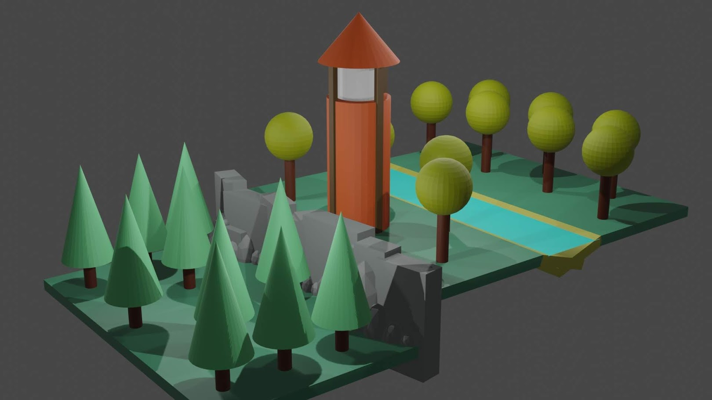
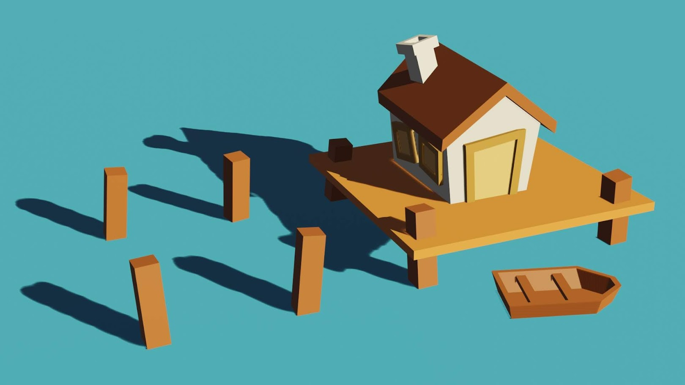
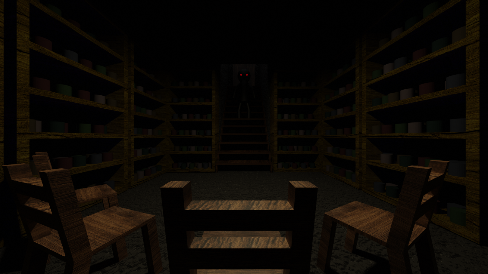
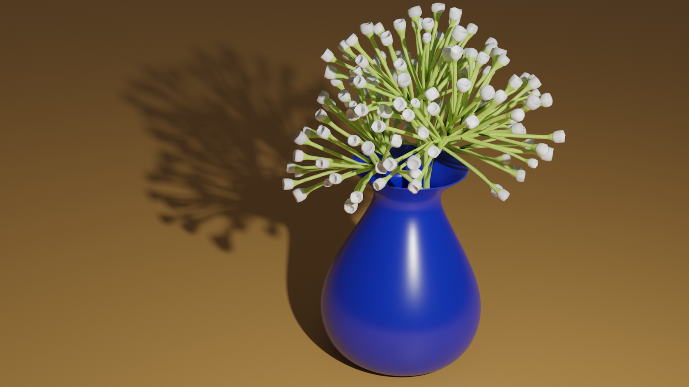
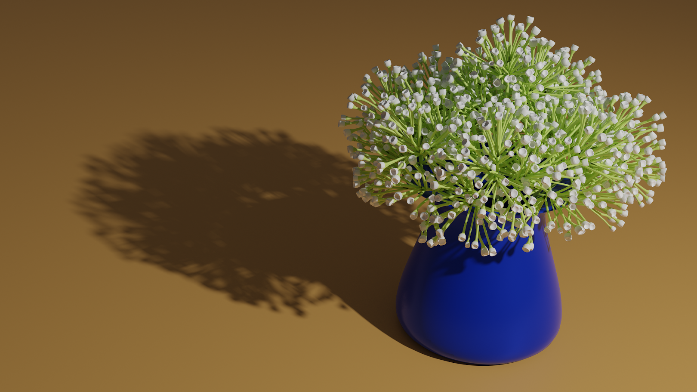

Before freshman year in college I wanted to try out some 3D modeling to see what that was like. First I followed a tutorial to create the following two scenes:

They were very simple low-poly scenes that mostly just used the basic blender shapes. These gave me the fundamentals to go on and start doing my own projects. Then I created the following three images:

I am happy with how these turned out and it was a good introduction to the absolute basics of 3D modeling.