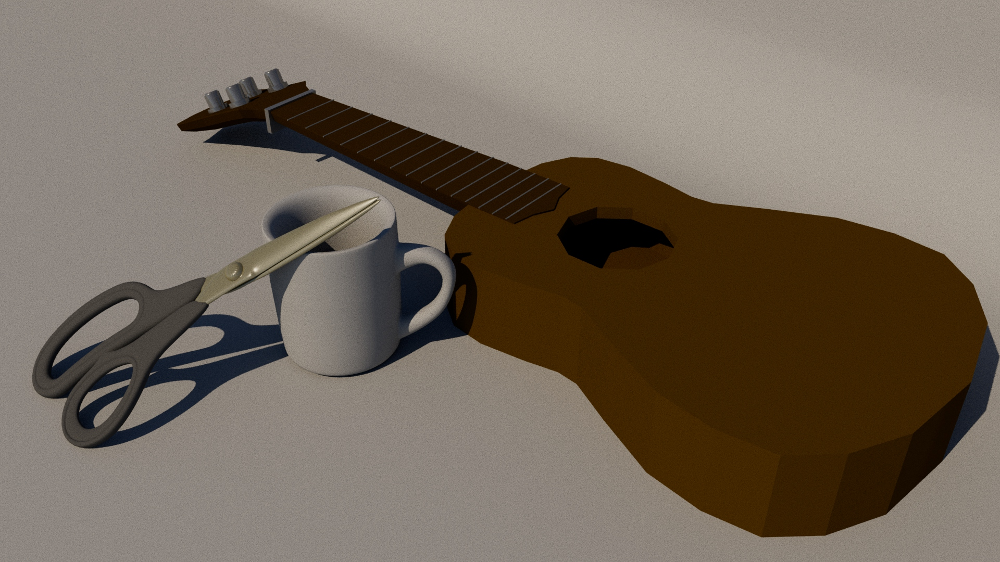
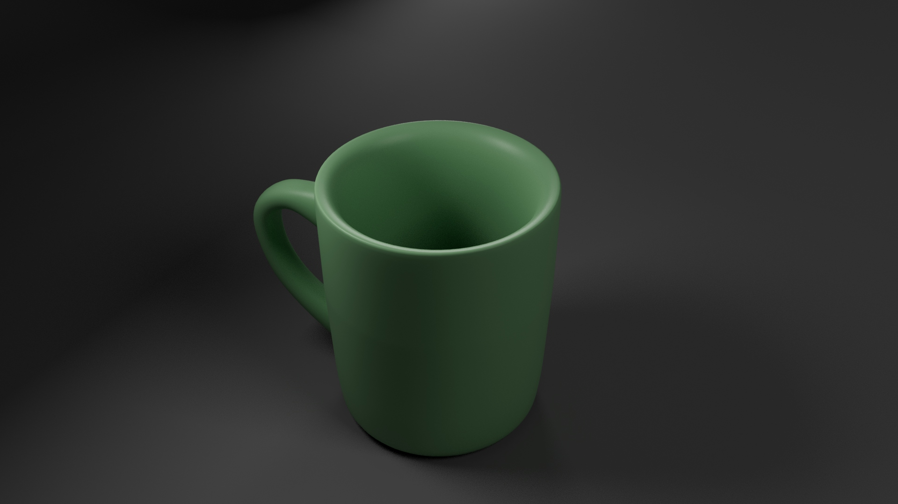
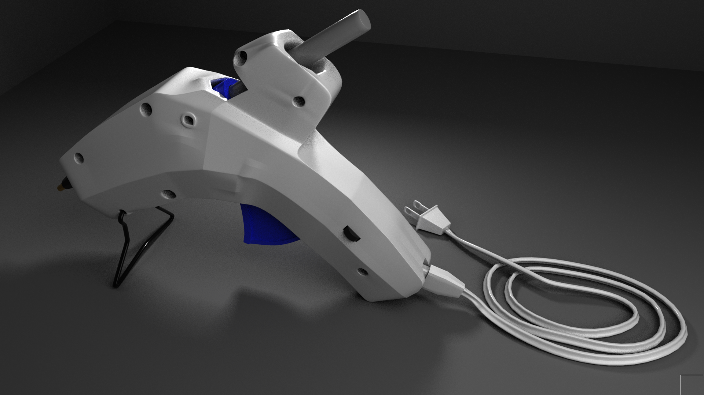
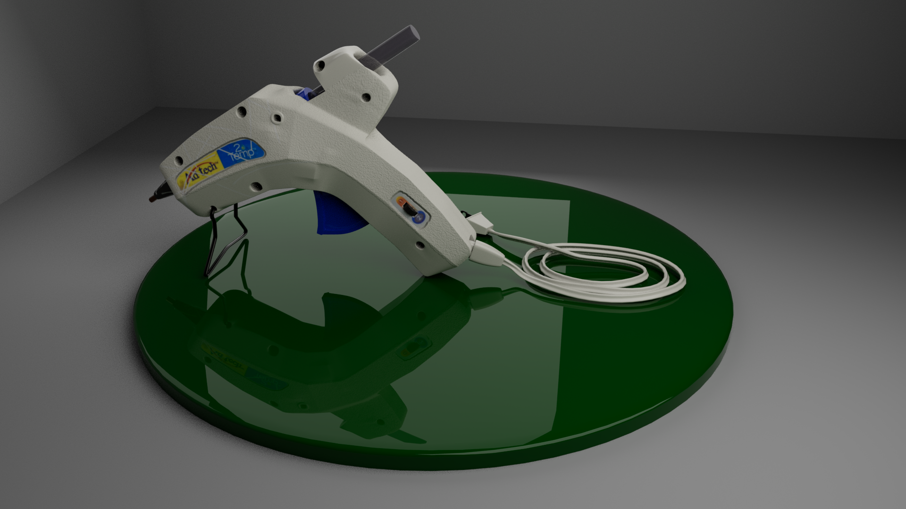
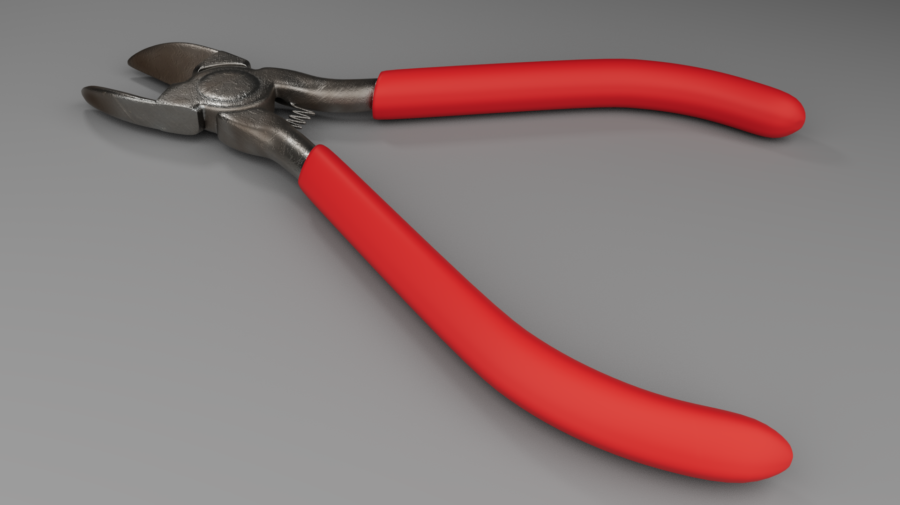
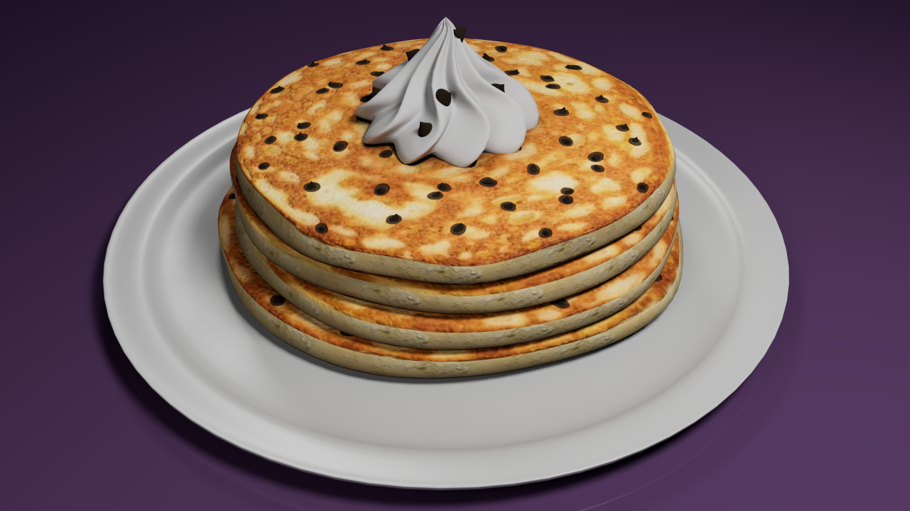

While at Drexel, I took a course on 3D modeling. In that class I learned the fundamentals of some more advanced modeling techniques as well as texture mapping. Here is a showcase of the projects that I was able to create within that class:


  
  
  
  
  
  
  
  


Probably the most important thing I learned in the class is about the different map types. Such as albedo, roughness, and normal maps. I had no idea what any of these were prior to this class and it has help in future projects to know about these different maps and how they interact with light rays when rendering.