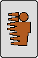
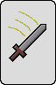
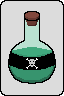
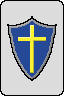
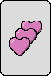


Play Here 


The goal of this project was to see how close to a finished game I could get within a week of time.

The game is a simple matching game where the player must make a match of four cards in order to get their bonus. Then they can try to match some of the other cards!



There is a total of 6 cards in the game that correspond to health, dodge, attack, poison, block, and regeneration. The effects would stack for each card that the player would get.


  
  
  
  
  
  


One of the most important things that I had to realize for this assignment is that I did not have a lot of time to work on this. I needed to find what was going to give me the most benefit for the least amount of time. For this I decided to work on the animations for the cards such as the card shuffling and card flipping. It seems small but I think it really helps to boost the overall look and polish of the game. The animations were entirely programmatic so it was fun to use math to try and generate animations. This is one of the first times that I have tried this outside of my animation class.