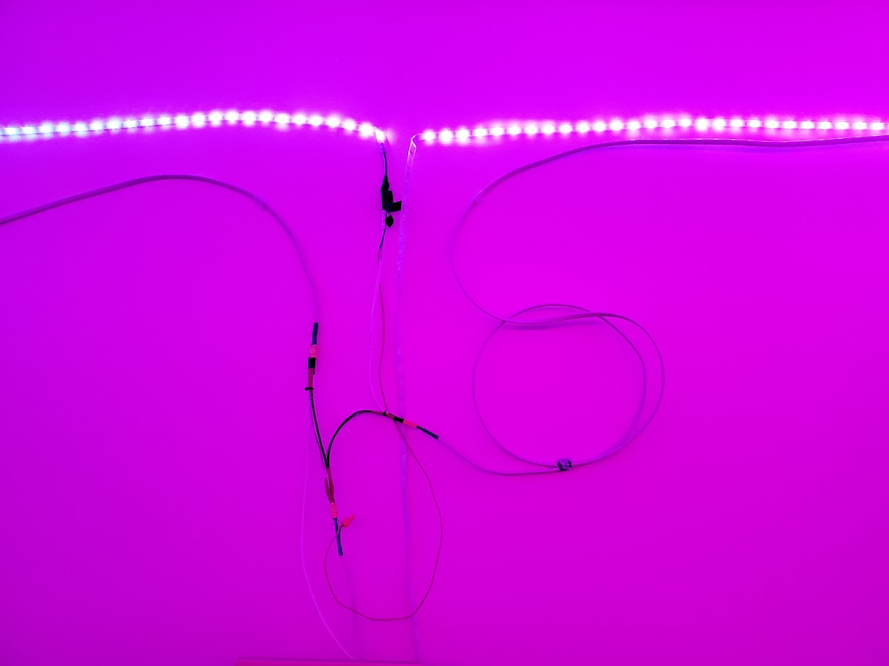

## Bluetooth LED Controller



This project started slightly before I began college. I wanted to have an LED strip in my room that I could change the colors with using an app. I wanted more customization though was typically offered. For this I wired up an LED strip to an Arduino and then wrote some functionality that would parse a string for the color information. Now I connected to the arduino through bluetooth using my Android phone and created an app that would send the string information to the Arduino.

This supported a solid color where the LED strip would just be one color.

A gradient that could be selected with up to four colors. This would then be able to cycle around the room with the gradient moving with it.

Party mode, a color is randomly selected every given time interval.

My wire management was not the best, but the end result created some pretty cool lights for my freshman dorm!