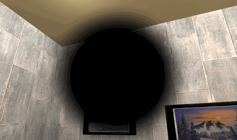



 


Download 


Insider Perspective involves a camera technician who is working as a CCTV personnel inside the esteemed megabucks manor, looking to get the money he's owed. Steel A. Lotta has worked for his boss, Jimmy D. Bucks, for a while now and Jimmy has stopped paying him. Jimmy however is still spending money on his precious relics to store around his manor. Steel’s friend, Slip N. Anout, convinces him to collect the money he's owed. Play as Steel and use the CCTV cameras to navigate a delivery bot throughout the manor, collecting any relics you can find to reclaim your missing paychecks.



This project was made as part of a six person team for Junior design project 1 at Drexel. I was the producer on the team organizing team operations and fascilitating communication with our publisher the professor. I also worked on the different camera shaders that were featured in the game. Here is some examples of what was available:


  
  
  
  
  
  


I was happy to get to work on the camera shaders. All of them are image space shaders that just change the resulting image in some way. For example, the inverted one just inverts all the colors in the image. It was a fun introduction to working with shaders within Unity.

I also enjoyed being the producer on the team. This mean that I had to keep our GitHub organized as well as keep assigned tasks in order. This was my first time as a producer but I enjoyed the challenge and enjoyed making sure everyone was happy to work on the game!