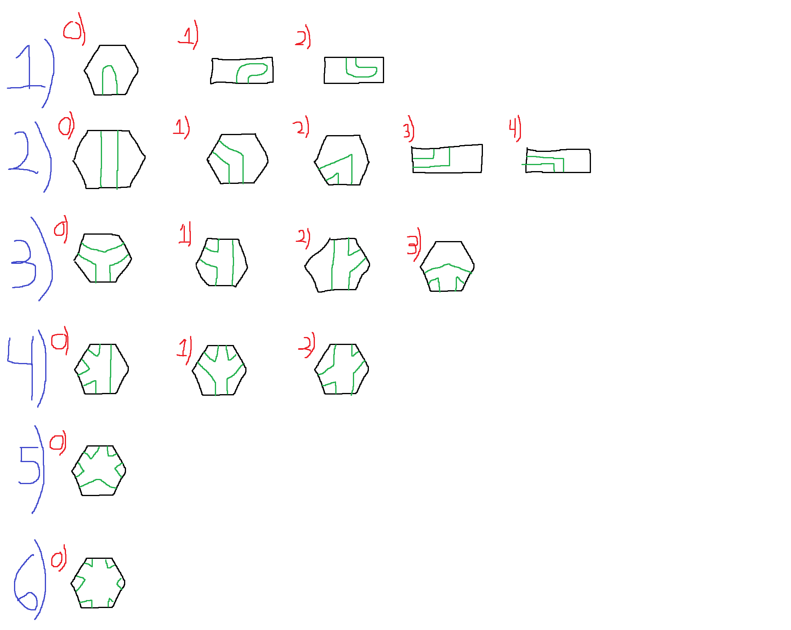
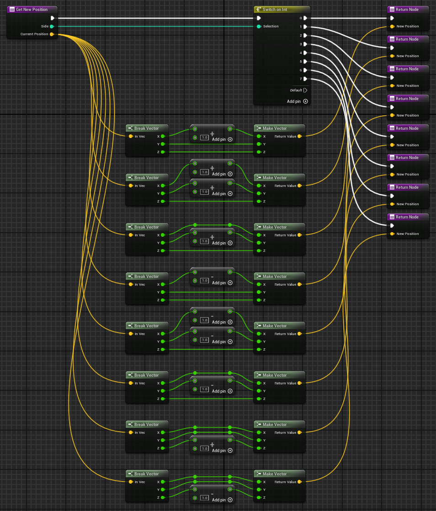

This project served as an way to learn to Unreal Engine 5. The goal was to setup a simple cave generation algorithm. Here is a demo showcasing the end result:



There was a total of 17 possible layouts for the caves to generate within a 3D hexagonal grid layout. Here is an image of all the possible layouts:

The blue number corresponds to the nunber of entries to the rooms. The red number is just an index. The engine will start with one enterance on one side and then connects to another room type. It also supports traveling vertically within the 3D space as well. This system was meant for a game where each segment could be handcrafted as some cave segment then each of the pieces can be stitched together to have some random generation with individual hand-crafted rooms.

Overall, the project was a great introduction to Unreal Engine and I really enjoyed working with their blueprint system. I had a lot of fun just making sure that it looked clean and was easily readable through functions.

Lastly, I did also get to experiment with creating some of my own blueprint functions in C++ since they were just too complicated for blueprint alone. I was surprised with how easy it was to handle data between each and it is pretty interesting to see how blueprint can be very user friendly and simple for people to prototype in. Meanwhile, you can still have people in the backend working on individual blueprint components for anything too complicated or performance heavy.