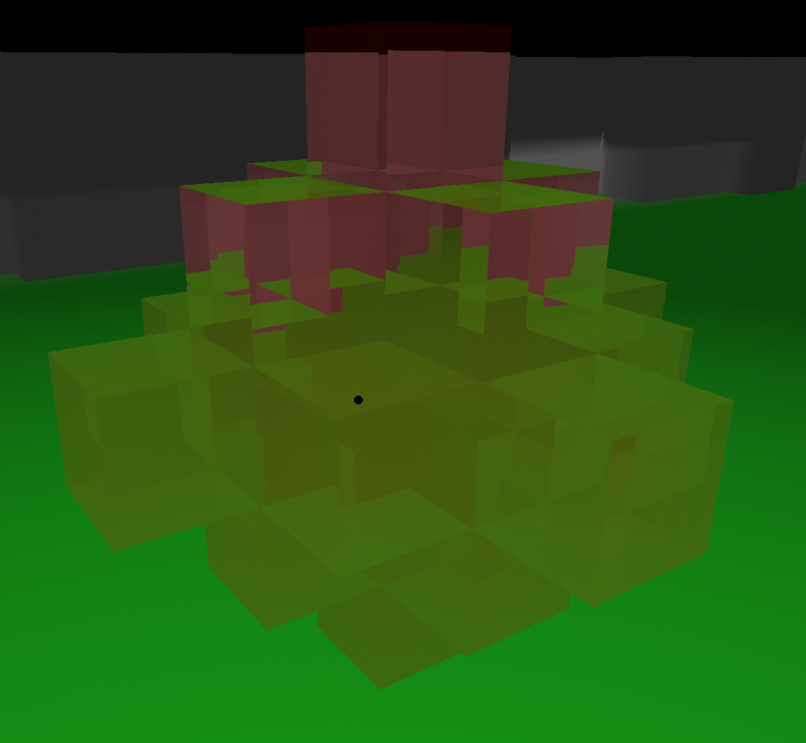

When a ray enters a block of glass, using [Snell's Law](https://en.wikipedia.org/wiki/Snell%27s_law), the direction of the ray is changed. This happens again when exiting a block of glass. This allows for some interesting looking light refractions where the rays seem to bend the longer thay travel through the glass.

I used [a fantastic tutorial on how to do reflections, refractions, and a fresnel effect](https://www.scratchapixel.com/lessons/3d-basic-rendering/introduction-to-shading/reflection-refraction-fresnel.html) to achieve the refractions. This is a wonderful guide on how it works in the real world and how it can be achieved within a ray tracing engine.

I want to add reflections but this is a bit trickier. To add reflections I would recursively call the raycast function to instance another ray; however, GLSL does not support recursion. This means that I have to get a little tricky with how to instantiate another raycast and store its information. I will want to set the maximum number of reflections to do this and probably loop over it for however many reflections are needed. For now though I am happy with this effect and it is very interesting to see how the light changes in some weird shapes with the glass.