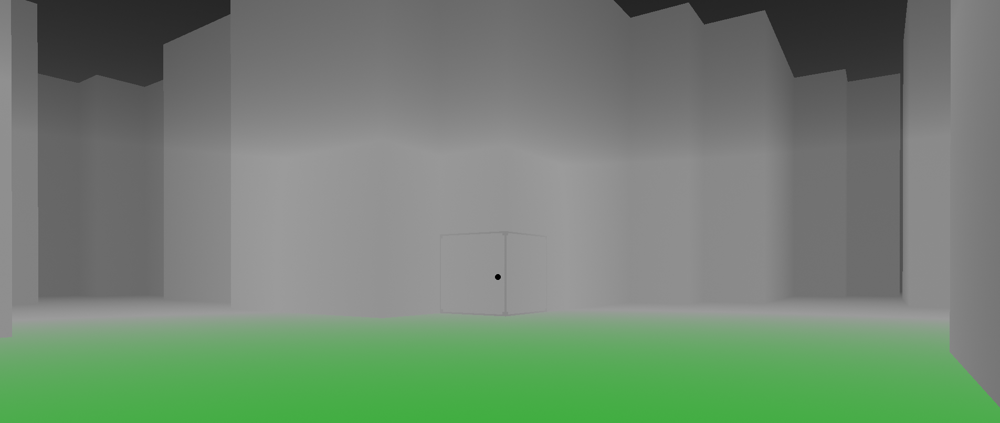

Once a ray is traveling through the scene it keeps track of how far it has traveled within the fog block. That amount is then used at the end to change the resulting pixel color and add more of the fog color the farther it has traveled. The larger the fog volume, the more the fog color is shown.