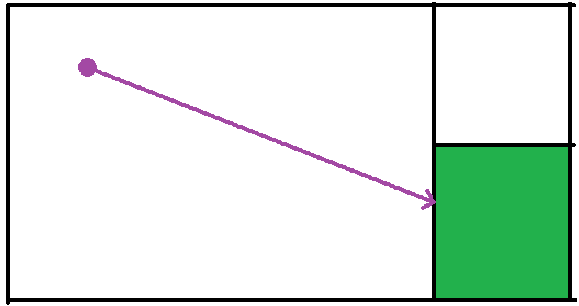

Building on [Plane-Assisted Ray Marching](), we can group similar voxels together and then travel through the entire cuboid at once.



For example, if a chunk, which is 64x64, consists entirely of air blocks. We could group them together as one block instead and state that a ray within that chunk can do the next ray-plane intersection at the farthest area. To do this it requires storing more information inside of each block.

Currently, the block contains 34 bits of information about the block, stating what type it is. Then it has another 30 bits for the cuboid information. 5 bits correspond to each direction which means that the maximum size for a cuboid is 32x32. So 5 bits are how far the cuboid stretches in the positive X direction, another 5 bits correspond to how far the cuboid stretches in the negative X direction, etc.

This allows for much more efficient ray traversal since the cuboid information and the block information is received entirely in one texture call and then the ray-plane intersection function just offsets the plane in the given direction by the stated amount. Much larger scenes can be rendered at a much higher framerate.

Below is the new ray iteration loop in GLSL. This definitely needs to be optimized and cleaned up later on but for the research paper that I want to get finished before May 20th 2024, I am pretty happy with where it currently is.

The most important thing is that now the currentblock is represented with two 32bit unsigned intergers. The red channel or first component represent the block type (0 is void, 1 is air, 2 is fog). The green channel or second component represents the cuboid information. This will keep traveling until it hits a block that is not air, fog, or glass (1, 2, or 15), or if the ray has traveled for 1048 cuboids. (There was previous support for basic entities but that is not currently implemented)

```GLSL
float totalDistance = 0.0f;
ivec3 currentBlockPos = getBlockCoords(rayOrigin);
uvec2 previousBlock = getBlockInfo(currentBlockPos);
uvec2 currentBlock = previousBlock;
int blockSteps = 0;
float fogAmount = 0.0f;
float glassAmount = 0.0f;
bool entityHit = false;
while ((currentBlock.r == 1 || currentBlock.r == 2 || currentBlock.r == 15) && blockSteps < 1048 && !entityHit) {		
    vec3 signedDirection = sign(rayDirection);

    ivec3 distDir = ivec3(round(signedDirection.x), 0, 0);
    float cuboidModifier = signedDirection.x > 0 ? getCuboidPositiveX(currentBlock.g) : -1 * float(getCuboidNegativeX(currentBlock.g));
    vec3 planeOrigin = vec3(float(currentBlockPos.x) + 0.5f * signedDirection.x + cuboidModifier, currentBlockPos.yz);
    vec3 planeNormal = vec3(-sign(rayDirection.x), 0.0f, 0.0f);
    float minDist = planeIntersectionDistance(rayOrigin, rayDirection, planeOrigin, planeNormal);

    cuboidModifier = signedDirection.y > 0 ? getCuboidPositiveY(currentBlock.g) : -1 * float(getCuboidNegativeY(currentBlock.g));
    planeOrigin = vec3(currentBlockPos.x, float(currentBlockPos.y) + 0.5f * signedDirection.y + cuboidModifier, currentBlockPos.z);
    planeNormal = vec3(0.0f, -sign(rayDirection.y), 0.0f);
    float newDist = planeIntersectionDistance(rayOrigin, rayDirection, planeOrigin, planeNormal);
    if (newDist < minDist) {
        distDir = ivec3(0, round(signedDirection.y), 0);
        minDist = newDist;
    }
    cuboidModifier = signedDirection.z > 0 ? getCuboidPositiveZ(currentBlock.g) : -1 * float(getCuboidNegativeZ(currentBlock.g));
    planeOrigin = vec3(currentBlockPos.xy, float(currentBlockPos.z) + 0.5f * signedDirection.z + cuboidModifier);
    planeNormal = vec3(0.0f, 0.0f, -sign(rayDirection.z));
    newDist = planeIntersectionDistance(rayOrigin, rayDirection, planeOrigin, planeNormal);
    if (newDist < minDist) {
        distDir = ivec3(0, 0, round(signedDirection.z));
        minDist = newDist;
    }

    // Fog
    if (currentBlock.r == 2) {
        fogAmount += minDist;
    }

    // Glass
    if (currentBlock.r == 15) {
        glassAmount += minDist;
    }

    entityHit = entityCheck(rayOrigin, rayDirection, minDist);
    if (!entityHit) {
        rayOrigin += rayDirection * minDist;
        currentBlockPos = getBlockCoords(rayOrigin + 0.5 * distDir);
        previousBlock = currentBlock;
        currentBlock = getBlockInfo(currentBlockPos);
        totalDistance += minDist;
        blockSteps += 1;

        if (currentBlock.r == 15 && previousBlock.r != 15) { // Going into glass
            const vec3 normal = -vec3(distDir);
            rayDirection = refract(rayDirection, normal, glassRefractionIndex);
        } else if (previousBlock.r == 15 && currentBlock.r != 15) { // Coming out of glass
            const vec3 normal = -vec3(distDir);
            rayDirection = refract(rayDirection, normal, glassRefractionIndex);
        }
    }
}
```