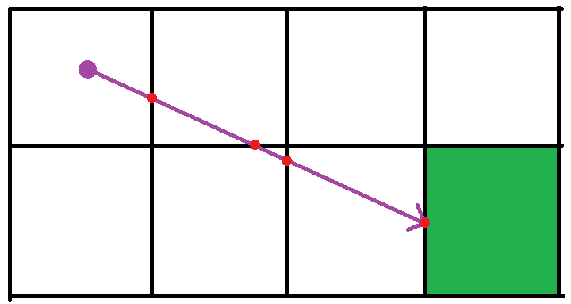

From the main camera a screen is projected in the direction that the player is stated to be looking. Then that screen is divided up by the number of pixels in the viewport and a ray is created for each one. Then there is a ray origin (camera origin) and a direction to travel.

So first the ray will check the sides of the cube that it is currently in to see which one it will hit. This is done through a ray-plane intersection which returns a point. Using the distance to that point we can find the surface that will be hit. After doing three ray-place intersections, which ever has the shortest distance is the surface that is hit.

There is also no need to check for all six planes of the cube since, in the X direction, the ray can only be traveling in either positive X, negative X, or is parallel to the x axis. So the first test is to figure out which of these states it is in. For simplicity the case where it is parallel is ignored and treated as postiive X. Doing this for each axis means we only need to check three surfaces. Next we can start the raymarch and keep traveling until a block is hit.

It will travel block by block until eventually a block is hit. Currently this will just return a solid color for the block but this can easily be turned into UV coordinates using the intersection point.